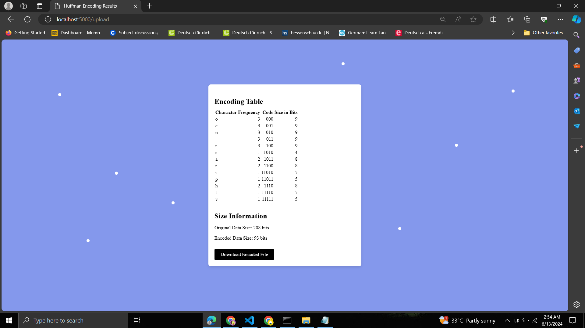

# Data Compression Using Huffman Coding

This project implements lossless data compression for text files using Huffman coding. It includes both compression and decompression functionalities and features a web page that allows users to upload a text file and receive a compressed version of the file.

## Project Overview

Huffman coding is an algorithm used for lossless data compression. It assigns variable-length codes to input characters, with shorter codes assigned to more frequent characters. This results in a compressed file that is smaller in size compared to the original file. The compression and decompression processes are as follows:

1. **Compression**:
    - The algorithm reads the input text file and calculates the frequency of each character.
    - It builds a binary tree (Huffman tree) where each leaf node represents a character from the input file, and the path from the root to the leaf node represents the character's code.
    - The original text file is then encoded using these variable-length codes, resulting in a compressed file.

2. **Decompression**:
    - The compressed file is decoded back to the original text file by traversing the Huffman tree based on the binary codes.


## Features

- **Huffman Coding Algorithm**: Implements the core Huffman coding algorithm for both compression and decompression.
- **Web Interface**: A user-friendly web page where users can upload their text files and download the compressed version.
- **Lossless Compression**: Ensures that the decompressed file is identical to the original file with no data loss.

## How to Use

### Web Interface

1. Open the web page in your browser.
2. Upload your text file using the provided file input.

3. Click the "Compress" button to compress the file.
4. Download the compressed file.


### Running Locally

1. Clone the repository:
    ```sh
    git clone https://github.com/yourusername/your-repository.git
    ```
2. Navigate to the project directory:
    ```sh
    cd your-repository
    ```
3. Install the required dependencies:
    ```sh
    npm install
    ```
4. Start the local server:
    ```sh
    npm start
    ```
5. Open your browser and go to `http://localhost:5000` to use the web interface.


## Future Enhancements

- Add support for compressing other file types.
- Improve the user interface for better user experience.
- Implement additional compression algorithms for comparison.
